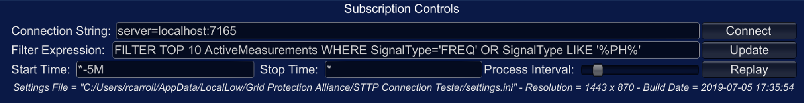

# Using STTP Connection Tester

## Subscription Controls

The subscription controls dialog is used to define the parameters for the STTP connection. The dialog is normally minimized when the connection is active and only the title of the dialog is visible. To activate the dialog when it is minimized, click on the title.



The following table details the functionality of the controls:

| UI Control | Function |
| :--------: | :------- |
| `Connection String`<br/>Text Box | Defines the connection string for the publisher to be connected to. The format is `server=hostname:port` where `hostname` can be the DNS name of IP of the STTP data publisher. The `port` is the STTP port the data publisher is listening on. If you would like to receive data values back on UDP, you can add a `dataChannel` setting to connection string. For example, adding the following `;dataChannel=9191` to end of the connection string would request data values flow back to the STTP Connection Tester on port `9191`. |
| `Connect`<br/>Button | Attempts a connection to the STTP data publisher defined in the `Connection String`. |
| `Filter Expression`<br/>Text Box | Defines an expression used select the desired signals to trend. This syntax is similar to a SQL clause, but does not implement the full SQL language, see [Filter Expressions](https://github.com/GridProtectionAlliance/gsf/blob/master/Source/Documentation/FilterExpressions.md) documentation. |
| `Update`<br/>Button | Updates the active subscription with changes specified in the `Filter Expression`. |
| `Start Time`<br/>Text Box | Defines the timestamp or relative interval to now for the _start_ time of a requested historical replay, see [Historical Replay Time Intervals](#historical_replay_time_intervals) below. |
| `Stop Time`<br/>Text Box | Defines the timestamp or relative interval to now for the _stop_ time of a requested historical replay, see [Historical Replay Time Intervals](#historical_replay_time_intervals) below. |
| `Process Interval`<br/>Slider | Defines the replay speed of an active historical replay. The speed can be controlled while the replay is in progress allowing the data interval to be slower when the slider value is smaller, i.e., to the left, and faster then the slider value is larger, i.e., to the right.
| `Replay`<br/>Button | Attempts to start a historical data replay on an already active connection to an STTP data publisher. Note that not all data publishers will be archiving data and/or support historical replay. When the historical replay completes, or the data publisher does not support the function, the connection will automatically transition back to a real-time subscription. |

### Historical Replay Time Intervals

Relative time intervals are parsed based on an offset to current time in UTC specified by `*`.

The value can be specified in one of the following formats:

| Time Format	| Example | Description |
| :---------: | :-----: | :---------: |
| `yyyy-mm-dd HH:MM:ss.fff` | `2020-12-30 23:59:59.033` | Absolute date and time |
| `*` | `*` |	Evaluates to current time, i.e., _now_. |
| `*-Ns` | `*-20s` | Evaluates to `N` seconds before _now_ |
| `*-Nm` | `*-10m` |	Evaluates to `N` minutes before _now_.
| `*-Nh` | `*-3h` |	Evaluates to `N` hours before _now_. |
| `*-Nd` | `*-1d` |	Evaluates to `N` days before _now_. |

Note that positive values are also supported, for example,
`*+2d` would evaluates to 2 days from _now_. Future values keep a historical subscription active into the future so long as the data publisher and active replay rate supports the time frame.

## Hot Keys

Note that hot keys only work when `Subscription Controls` dialog is minimized.

|  Key  | Action              |
| :---: | :------------------ |
| `ESC` | Exit Application    |
|  `C`  | Connect / Reconnect |
|  `D`  | Disconnect          |
|  `+`  | Increase Font Size  |
|  `-`  | Decrease Font Size  |

## Settings File

Configurable settings for the STTP Connection Tester are define in the text-based `settings.ini` file.

Default location of `settings.ini` on Windows deployments can be found in the user's local low application data folder:

```
%appdata%\..\LocalLow\Grid Protection Alliance\STTP Connection Tester\
```

The settings are defined as follows:

| Setting | Default Value | Description |
| :-----: | :-----------: | :---------- |
| AutoInitiateConnection | `False` | When value is `True`, connection to last defined connection string will be attempted on startup. |
| StartTime | `*-5M` | Last UI defined timestamp or relative interval to now for start time of historical replay. |
| StopTime | `*` | Last UI defined Last timestamp or relative interval to now for stop time of historical replay. |
| FilterExpression | `FILTER TOP 10 ActiveMeasurements WHERE SignalType='FREQ' OR SignalType LIKE 'VPH*'`` | Last UI defined filter expression that defines which points to select. |
| Title | `STTP Connection Tester` | Title that appears above the graph plane. |
| MaxSignals | `30` | Maximum number of signals that will be trended. |
| LegendFormat | `{0:SignalTypeAcronym}: {0:Description} [{0:PointTag}]` | Format of metadata description for signal trend legend. |
| PointsInLine | `50` | Number of points to display per trend line. |
| ConnectionString | `server=localhost:7165;` | Last UI defined connection string. |
| StatusDisplayInterval | `10000` | Maximum time, in milliseconds, that status updates will remain visible.
| StatusRows | `4` | Maximum number of rows that will be maintained for status updates. |
| LineWidth | `4` | Display width of trend lines. |
| LineDepthOffset | `0.75` | Z-axis depth offset for multiple trend lines. |
| GuiSize | `1` | Last UI defined font size factor for the text based GUI elements, e.g., subscriber controls. Valid values are from `1` to `3`.
