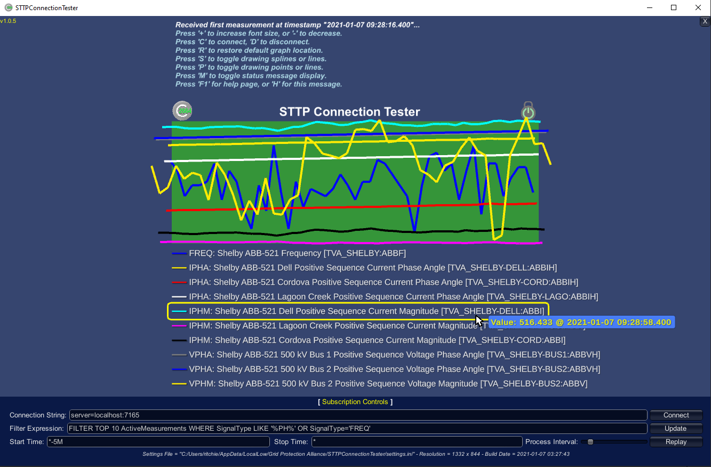

# STTP Connection Tester

The STTP Connection Tester is used to validate that a subscription based connection is working as expected. It can also be used to validate filter expressions that can be used to select a set of points in hosted STTP publishers.

This application is a simple graphical program that uses the STTP API to display trending lines for each subscribed measurement in the specified filter expression - trend lines are updated as values are received in real-time. Mouse controls (or finger gestures) will allow rotation and zoom, arrows keys will adjust X/Y location. Clicking on the "Subscription Controls" area at the bottom of the screen will pop-up a control window to allow you to change connection information (e.g., server/port to connect to) and the filter expression can be used to replay data if a historian is enabled.

[Download](https://github.com/sttp/connection-tester/releases)
 / [Documentation](https://sttp.github.io/connection-tester/)

